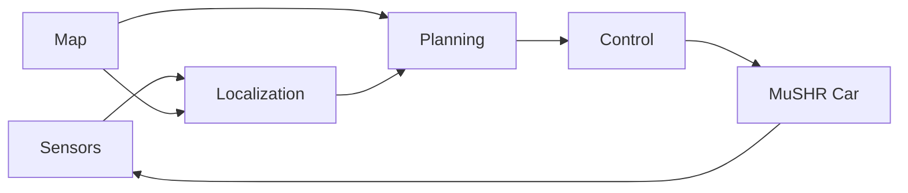
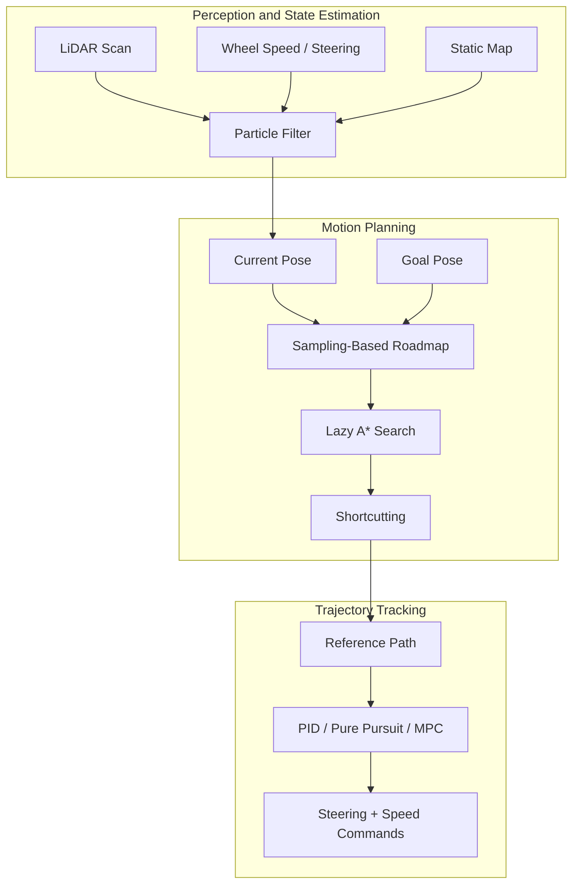
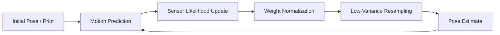
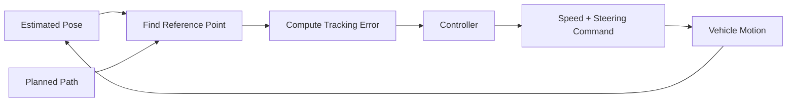
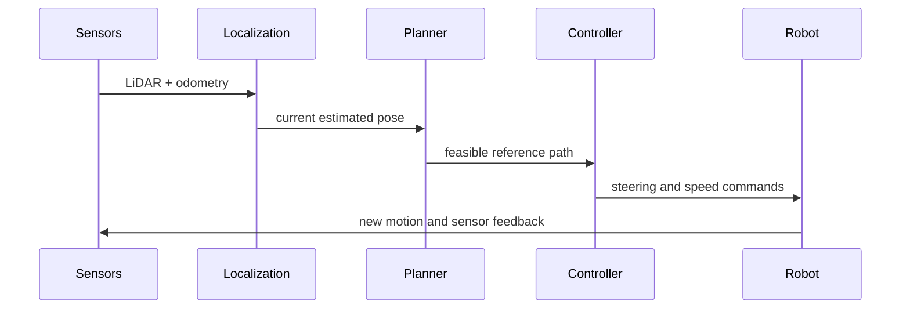

# MuSHR478: Autonomous Driving on the MuSHR Platform

https://github.com/user-attachments/assets/38d2eee8-ae72-4e07-97a7-ace7e0d90ed2

This project builds a complete autonomous navigation stack for an Ackermann-steered MuSHR car.  
The system solves a full closed-loop driving problem in a mapped environment:

- estimate the vehicle pose from noisy sensors,
- plan a feasible path to the goal,
- track that path with vehicle-aware control,
- and continuously repeat this loop on real hardware.

Rather than treating localization, planning, and control as isolated assignments, this repository integrates them into a working sense-plan-act pipeline that can execute multi-goal autonomous navigation.

---

## 1. Problem Statement

The robot is a small autonomous car with Ackermann steering, which means it cannot move sideways or rotate in place like a differential-drive robot. That constraint changes the entire system design:

- localization must estimate both position and heading accurately,
- planning must produce curvature-feasible motion,
- control must respect the car's steering geometry,
- and all modules must stay stable under real sensor noise and execution delay.

The goal of this project is to make the MuSHR car navigate on a known map from its current pose to one or more target poses while avoiding obstacles and maintaining trackable motion.

---

## 2. System Overview

The navigation stack follows a classical closed-loop robotics architecture:

This loop answers three core questions:

- **Where am I?** solved by particle-filter localization.
- **Where should I go?** solved by roadmap-based motion planning.
- **How do I get there?** solved by path-tracking control.

At the system level, the project is organized around these logic blocks:

---

## 3. Core Design Logic

This project is best understood as a dependency chain:

1. **Localization** provides the current vehicle state in the map frame.
2. **Planning** uses that state and the goal to compute a collision-free, curvature-feasible path.
3. **Control** converts that path into executable steering and speed commands.
4. **Execution feedback** updates the estimated pose, and the loop continues.

If any upstream module degrades, downstream behavior degrades immediately:

- bad localization causes the planner to start from the wrong state,
- weak planning produces paths that are hard to track,
- unstable control prevents even a valid path from being executed well.

Because of this coupling, the project emphasizes both algorithm design and system-level integration.

---

## 4. Localization: Estimating Pose with a Particle Filter

The localization module answers the question: **Where is the car in the map right now?**

The approach is particle filtering with three repeated stages:

### 4.1 Why particle filtering?

Particle filtering is a strong fit for this platform because:

- the vehicle model is nonlinear,
- the observation model from LiDAR is nonlinear,
- uncertainty can be multi-modal,
- and the method is practical to implement and debug in robotics systems.

### 4.2 Motion update

The motion model propagates each particle using Ackermann kinematics:

- forward motion is driven by speed,
- heading changes according to steering angle and wheelbase,
- and process noise is injected to model uncertainty in execution.

This means the filter does not assume the odometry is exact. Instead, it maintains a distribution of plausible vehicle states.

### 4.3 Sensor update

The sensor model compares real LiDAR measurements against expected measurements from the map:

- for each particle, a predicted scan is generated by ray casting,
- the predicted scan is compared against the observed scan,
- particles whose predicted observations match the real scan receive larger weights.

This step is what pulls the state estimate back toward the correct map-aligned pose when odometry drifts.

### 4.4 Resampling

Once the weights are updated, low-probability particles are removed and high-probability particles are replicated.  
Low-variance resampling is used to reduce sampling noise while preserving the dominant pose hypotheses.

### 4.5 Localization output

The final output is a weighted expected pose in the map frame, which becomes the planner's start state and the controller's feedback state.

---

## 5. Planning: Generating a Feasible Path

The planning module answers the question: **Given the current pose and a goal pose, what path should the car follow?**

The planner is not just searching on a 2D grid.  
It plans in a state space that includes orientation, because heading matters for an Ackermann vehicle.

### 5.1 State space and feasibility

The planning state is `(x, y, theta)` instead of only `(x, y)`.  
This is important because two poses at the same location but with different headings are not equivalent for a car-like robot.

### 5.2 Sampling-based roadmap

The planner uses a roadmap-style representation:

- sample many collision-free states in free space,
- connect nearby states,
- assign edge costs,
- and search the graph when a goal is requested.

Halton sampling is used to achieve more even coverage than naive random sampling, which improves roadmap quality for a fixed sampling budget.

### 5.3 Dubins connections

Connections between states are evaluated with Dubins motion, which enforces a minimum turning radius.

That means the roadmap is built from motions the vehicle can actually execute, rather than from idealized straight-line transitions that ignore steering constraints.

### 5.4 Lazy A* search

Once start and goal states are added to the roadmap, Lazy A* searches for a low-cost route:

- heuristic guidance accelerates the search,
- collision checking is deferred until needed,
- and unnecessary edge validation is avoided.

This makes planning more efficient when the roadmap becomes large.

### 5.5 Path shortcutting

After a valid path is found, shortcutting removes unnecessary intermediate vertices when a shorter valid direct connection exists.  
This improves path quality and reduces burden on the controller.

### 5.6 Planning output

The output is a sequence of feasible states in the map frame, which is then sent to the controller as a reference path.

---

## 6. Control: Tracking the Path on a Real Car

The control module answers the question: **How should the car steer and move right now to stay on the planned path?**

The controller runs in a closed loop using the estimated pose and the reference path:

Three controllers were implemented and compared:

- **PID**
- **Pure Pursuit**
- **MPC**

### 6.1 Why multiple controllers?

This project is not only about making the car move. It is also about evaluating the tradeoff between:

- simplicity,
- interpretability,
- stability,
- and predictive performance.

### 6.2 PID control

PID is the simplest baseline.  
It reacts to tracking error directly and is easy to implement, but it does not naturally encode vehicle geometry or future path shape.

### 6.3 Pure Pursuit

Pure Pursuit uses geometric tracking:

- choose a lookahead point on the path,
- express it in the vehicle frame,
- compute the circular arc from the car to that point,
- convert arc curvature into steering angle.

This makes it a natural fit for Ackermann steering and usually gives stable, intuitive behavior with relatively little tuning.

### 6.4 MPC

Model Predictive Control samples candidate control sequences, rolls them forward through the vehicle model, and scores them using trajectory cost.

Its advantages are:

- it reasons over future motion,
- it can include collision cost,
- and it handles tradeoffs between tracking quality and safety more explicitly.

In this project, MPC serves as the most advanced controller and is integrated into the final end-to-end pipeline.

### 6.5 Time-parameterized execution

The path is not tracked as geometry alone.  
It is also assigned speed over time, including ramp-up and ramp-down behavior, so the car does not try to accelerate or stop unrealistically.

---

## 7. End-to-End Integration

The main engineering challenge is not implementing each module independently.  
It is making them work together reliably in a real robotics loop.

The integrated execution flow is:

Integration required:

- consistent coordinate frames through ROS TF,
- stable communication between publishers, subscribers, and services,
- matching assumptions between planner output and controller input,
- and parameter tuning that works on hardware rather than only in simulation.

This end-to-end integration is what turns separate robotics algorithms into an autonomous navigation system.

---

## 8. Multi-Goal Navigation

The final system extends beyond single-goal motion.  
It supports multi-goal navigation by chaining plans:

- estimate current pose,
- plan from the current pose to goal 1,
- then from goal 1 to goal 2,
- and continue until the route is complete.

This demonstrates that the stack can support longer missions rather than only point-to-point navigation demos.

---

## 9. Practical Engineering Challenges

Several real-world issues matter in a project like this:

### 9.1 Localization and control are tightly coupled

If the localization estimate drifts, the controller may appear unstable even when the control law is correct.  
This means debugging cannot be done in a purely modular way.

### 9.2 Path quality affects trackability

A valid path is not automatically an easy path to track.  
Sharp heading transitions or unnecessary detours can increase control effort and failure risk.

### 9.3 Parameter tuning is part of the solution

Examples of high-impact parameters include:

- particle filter noise values,
- LiDAR sensor model weights,
- roadmap density and connection radius,
- lookahead distance in Pure Pursuit,
- rollout horizon and cost weights in MPC.

The final performance depends on how these parameters interact across modules.

### 9.4 Real-time constraints matter

The system must update fast enough for tracking to remain stable.  
Efficient ray casting, lazy collision checking, vectorized math, and compact controller loops all matter in practice.

---

## 10. Why This Project Matters

This project demonstrates more than familiarity with robotics algorithms.  
It shows the ability to:

- translate theory into executable code,
- connect perception, planning, and control into one architecture,
- reason about nonholonomic vehicle constraints,
- debug feedback loops instead of isolated functions,
- and tune a system until it works in a realistic robotics setting.

In short, this is an end-to-end autonomous driving stack for a small Ackermann robot, implemented with the mindset of a full robotics system rather than a collection of disconnected assignments.

---

## 11. Summary

The full logic of the project can be compressed into one line:

> estimate the pose, plan a feasible path, track it with vehicle-aware control, and repeat the loop until the robot reaches the goal.

That closed-loop structure is the core of the system, and every algorithmic choice in the project supports that goal.
