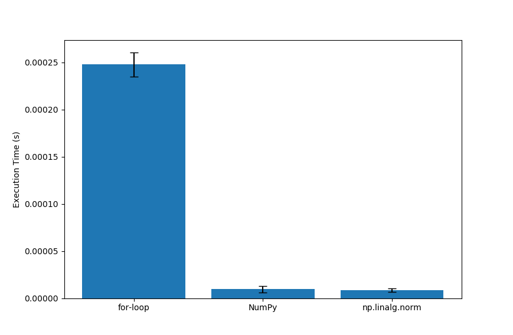
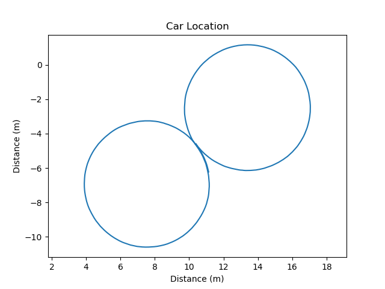
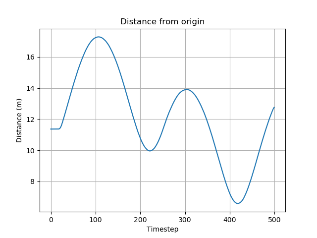
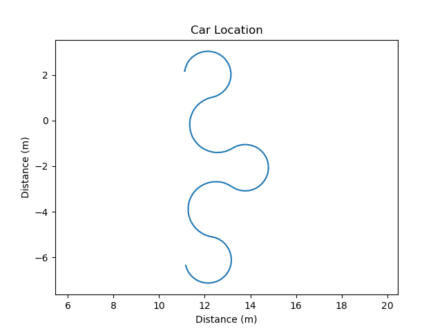
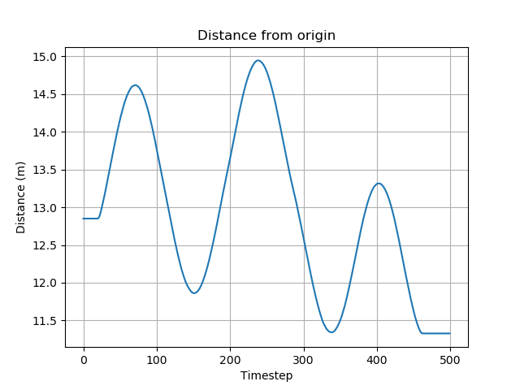

# Project 1 writeup

## 1. What a **node**, **topic**, **publisher**, and **subscriber** are and how they relate to each other

- **Node:** A node is an independent executable in ROS that performs a specific task, such as controlling a robot, reading sensors, or processing data. Think of it as a small program inside the ROS ecosystem.

- **Topic:** A topic is a named channel over which nodes communicate by sending messages. It’s like a bulletin board where nodes can post information for others to read.

- **Publisher:** A publisher is a node that sends messages on a specific topic. It “writes” data for other nodes to use.

- **Subscriber:** A subscriber is a node that listens to messages on a specific topic. It “reads” data published by other nodes.

**Relationship:** Publishers and subscribers communicate through topics. A publisher sends messages to a topic, and any subscriber to that topic receives the messages in real time, allowing nodes to exchange information without knowing each other directly.

## 2. Purpose of a **launch file**

Launch file in ROS is an XML or YAML configuration that allows you to start multiple nodes and set their parameters with a single command. Instead of running each node individually in separate terminals, a launch file can start all necessary nodes for a project simultaneously, set parameters, such as topics, map files, or robot settings and configure logging, remappings, and other runtime options. Essentially, it automates and organizes the startup of a ROS system, making it easier to run complex applications consistently.

## 3. RViz screenshot

## 4. Runtime comparison for norm implementation

## 5. Figure_8 location and distance

## 6. Tight_figure_8 location and distance

